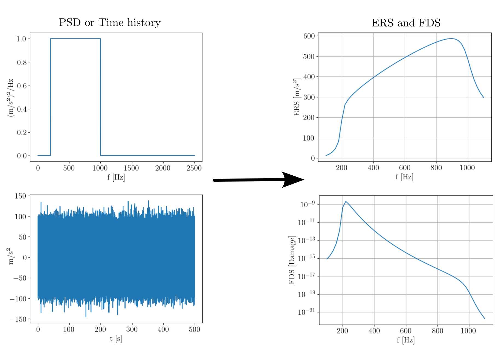

.. SDyPy project template documentation master file, created by
   sphinx-quickstart on Wed Jul 10 08:16:05 2019.
   You can adapt this file completely to your liking, but it should at least
   contain the root `toctree` directive.

Welcome to the FatigueDS documentation!
===============================================================

FatigueDS is a Python-based toolkit for calculating the Extreme Response Spectrum (ERS) and the Fatigue Damage Spectrum (FDS) for various types of signals. It supports calculations for sine, sine-sweep, and random signals, defined in both the time domain and the frequency domain.

For a quick guide on using the package, see :doc:`getting_started`. For short examples of using the package with sine and sine sweep signals, see :doc:`sine_sine_sweep_signal`. For a short example using a random signal, see :doc:`random_signal`

The source-code for this package is available on `GitHub <https://github.com/ladisk/FatigueDS>`_.

The theory is based on the book by C. Lalanne [1]_.

Contents
---------
.. toctree::
   :maxdepth: 2

   getting_started
   examples

References:
------------

.. [1] C. Lalanne, Mechanical Vibration and Shock: Specification development,
   London, England: ISTE Ltd and John Wiley & Sons, 2009